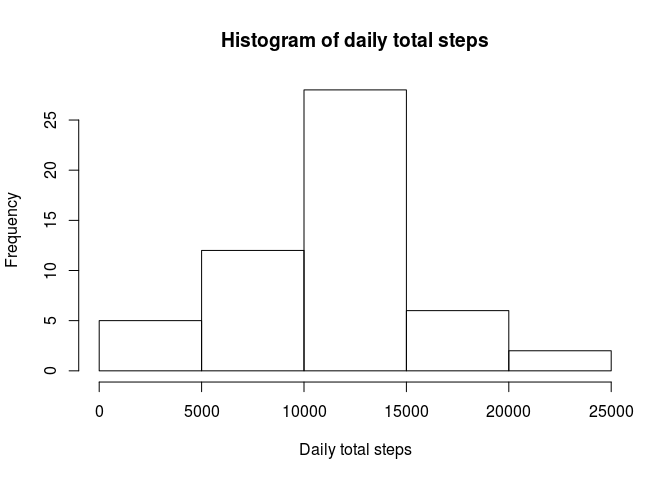
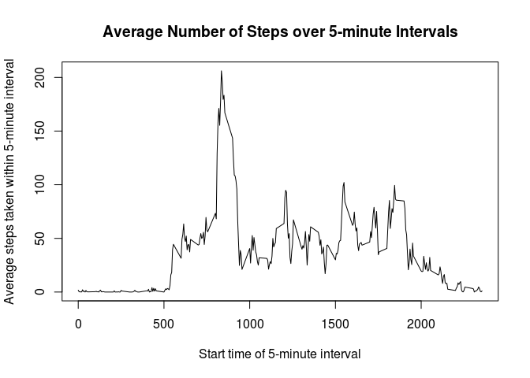
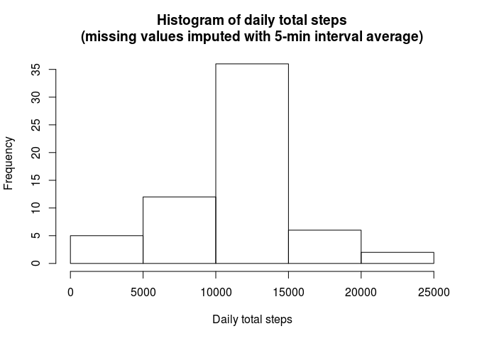
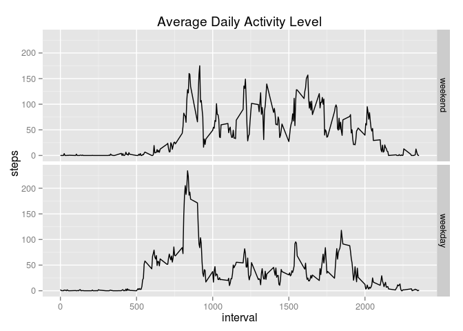

# Reproducible Research: Peer Assessment 1


## Loading and preprocessing the data

Read the comma separated data into a data frame (and set R options)

```r
activity = read.csv("activity.csv",
                    colClasses = c("integer","POSIXct","integer"))
options(scipen = 1, digits = 4)
```

## What is mean total number of steps taken per day?

First, group the data frame by date using the dplyr package and calculate daily total steps

```r
library(dplyr)
by_date = group_by(activity,date)
daily_total_steps = summarise(by_date,sum(steps))
```

Then, plot a histogram of daily total steps

```r
hist(daily_total_steps[["sum(steps)"]],
     main = "Histogram of daily total steps",
     xlab = "Daily total steps")
```

 

Finally, calculate mean and median for daily total steps

```r
mean_daily_total_steps = mean(daily_total_steps[["sum(steps)"]], na.rm=T)
median_daily_total_steps = median(daily_total_steps[["sum(steps)"]], na.rm=T)
```

The mean and median number of steps taken within a day are 10766.1887 and 10765 respectively.

## What is the average daily activity pattern?
Group the data by 5-minute interval, then average the number of steps taken per interval across all day, plotting the results in a time series plot. Finally, identify interval with highest average number of steps.

```r
by_interval = group_by(activity,interval)
interval_mean_steps = summarise(by_interval, mean(steps,na.rm=T))
plot(interval_mean_steps,
     type = "l",
     main = "Average Number of Steps over 5-minute Intervals",
     xlab = "Start time of 5-minute interval",
     ylab = "Average steps taken within 5-minute interval")
```

 

```r
interval_mean_steps = interval_mean_steps[order(interval_mean_steps[["mean(steps, na.rm = T)"]],decreasing=T),]
most_active_interval = interval_mean_steps$interval[[1]]
```
The 5-min interval with the highest average number of steps begins at 835h.

## Imputing missing values

Calculate the number of missing values in the data

```r
na_row_count = nrow(filter(activity, is.na(steps)))
```

There are 2304 intervals with missing data.

Fill in missing values using the mean number of steps calculated across all days with available data

```r
imputed_activity = activity
for (i in 1:nrow(activity)) {
  if (is.na(imputed_activity[[i,"steps"]])) {
    cur_interval = imputed_activity[[i,"interval"]]
    mean_interval_steps = as.numeric(interval_mean_steps[interval_mean_steps$interval == cur_interval,"mean(steps, na.rm = T)"])
    imputed_activity[[i,"steps"]] = mean_interval_steps
  }
}
```

Create histogram of daily total steps using imputed dataset. 

```r
imputed_by_date = group_by(imputed_activity, date)
imputed_daily_total_steps = summarise(imputed_by_date, sum(steps))
hist(imputed_daily_total_steps[["sum(steps)"]],
     main = "Histogram of daily total steps\n(missing values imputed with 5-min interval average)",
     xlab = "Daily total steps")
```

 

Finally, compare the mean and median against those of the original dataset with missing values.

```r
imputed_mean_daily_total_steps = mean(imputed_daily_total_steps[["sum(steps)"]], na.rm=T)
imputed_median_daily_total_steps = median(imputed_daily_total_steps[["sum(steps)"]], na.rm=T)

mean_change = (imputed_mean_daily_total_steps - mean_daily_total_steps)/mean_daily_total_steps * 100
median_change = (imputed_median_daily_total_steps - median_daily_total_steps)/median_daily_total_steps * 100
```

Imputing missing data caused a 0% increase in mean daily total steps and a 0.011% increase in median daily total steps, compared to the original dataset with missing values.

## Are there differences in activity patterns between weekdays and weekends?

Generate factor variable reflecting whether the observation took place on a weekday or weekend and generate panel plot comparing activity levels between weekends and weekdays.

```r
weekend_names = c("Saturday","Sunday")
activity$weekend_weekday = weekdays(activity$date) %in% weekend_names
activity$weekend_weekday = factor(activity$weekend_weekday,
                                  levels = c(TRUE, FALSE),
                                  labels = c("weekend", "weekday"))
by_weekend = group_by(activity,weekend_weekday,interval)
interval_mean_by_weekend = summarise(by_weekend,mean(steps, na.rm = TRUE))
names(interval_mean_by_weekend) = c("weekend_weekday","interval","steps")

library(ggplot2)

panel_plot = ggplot(interval_mean_by_weekend, aes(x = interval, y = steps)) +
  geom_line() +
  facet_grid(weekend_weekday~.) +
  ggtitle("Average Daily Activity Level")
print(panel_plot)
```

 

